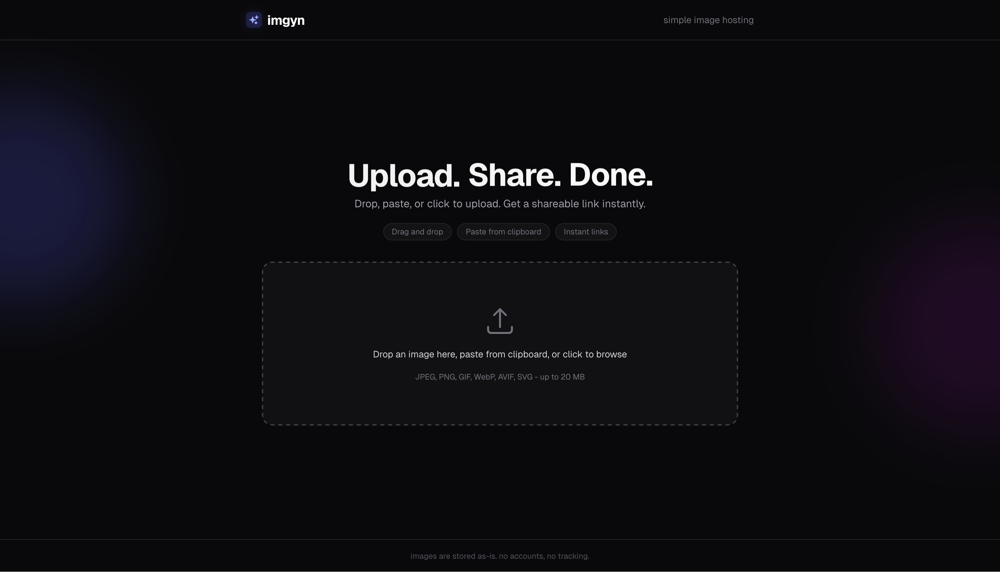

<p align="center">
  
</p>

# imgyn

Simple image hosting service built with Next.js and Tailwind CSS.

Upload an image, get:
- a share page URL: `/i/<id>`
- a direct image URL: `/i/<id>/raw`

## Screenshot

<p align="center">
  
</p>

## Requirements

- Node.js 20+
- npm

## Run locally

```bash
npm install
npm run dev
```

App runs at `http://localhost:3000`.

## Run with Docker

```bash
docker compose up -d --build
```

App runs at `http://localhost:3000`.

## Notes

- Supported uploads: JPEG, PNG, GIF, WebP, AVIF, SVG
- Max upload size: 20 MB
- Uploaded files are stored in `uploads/`
